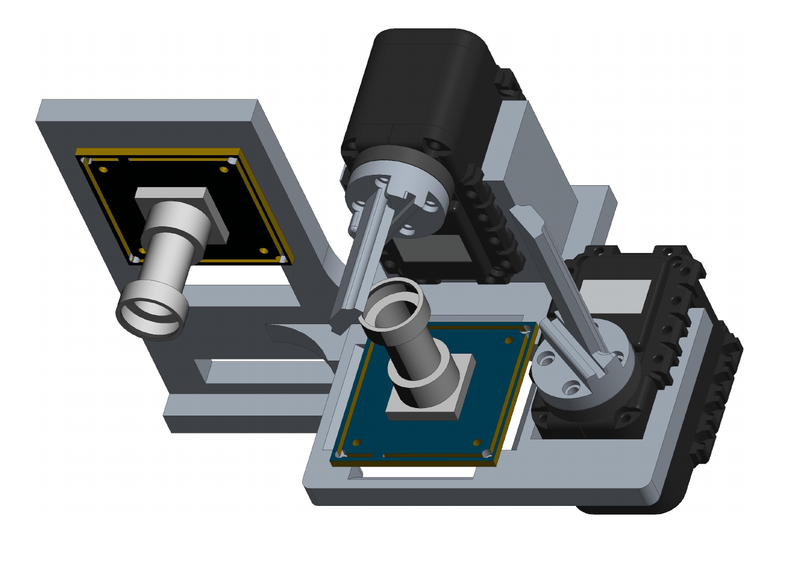
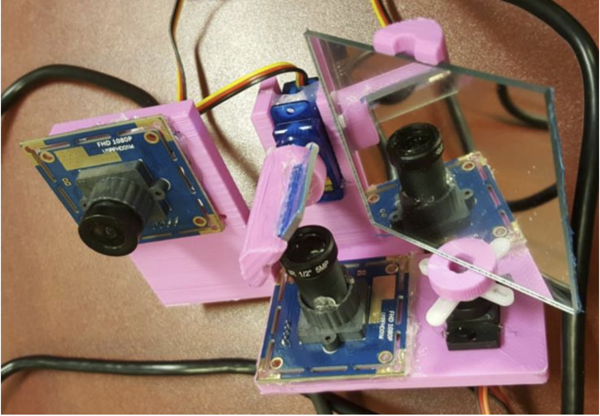

## EmbeddedEye
The original goal of the Embedded Eye was to offer a wide field of view surveillance of a scene while, at the same time, providing high-resolution images of key regions of interest.
Our goals were:
 * To mimic biological visual systems for improving upon conventional imaging technology
 * To develop a low power embedded system suitable for the remote application
 * To make the system light enough to be deployable on small UAVs
 * To develop a generic system which can be deployable in diverse applications
 * To be able to meet these goals, our requirements consisted of:
 * Wide field of view surveillance combined with high resolution video feed at key regions of interest
 * Rapid target focus
 * Smooth camera movements to mimic smooth pursuit movement
 * An independent system that can stream its content Function autonomously
    
  
 * Item 2a
 * Item 2b
## Project Images

## Authors
* **Amanpreet Walia** 
* **Gabriel Loja**
